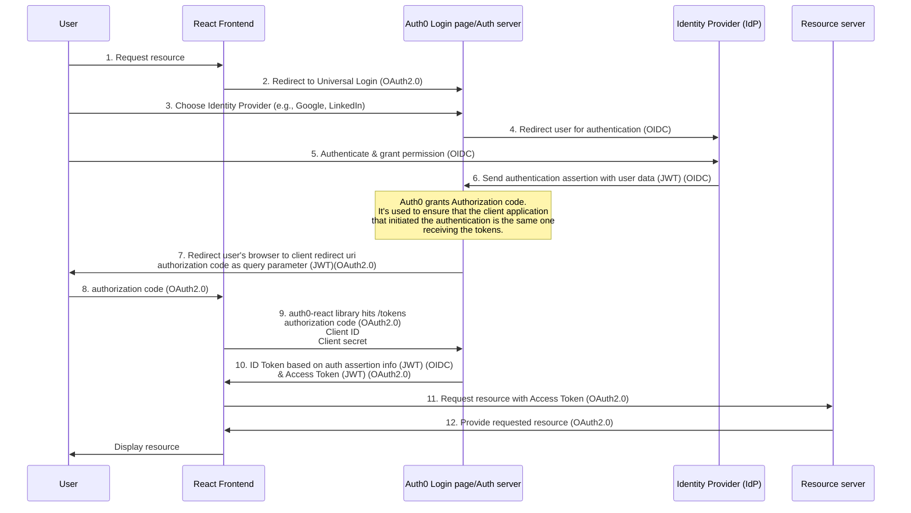
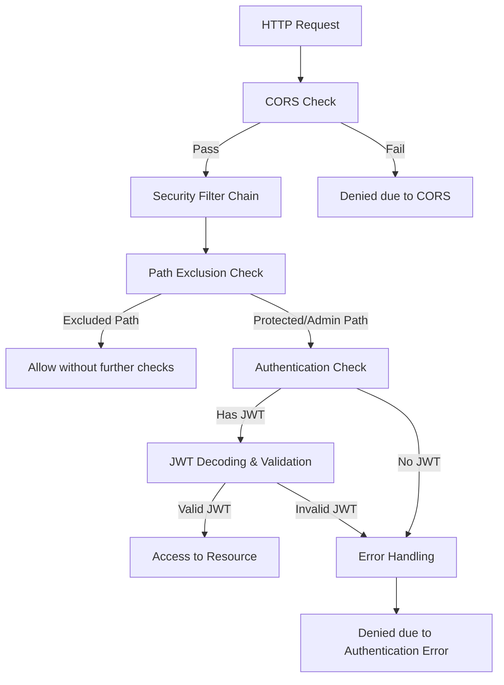
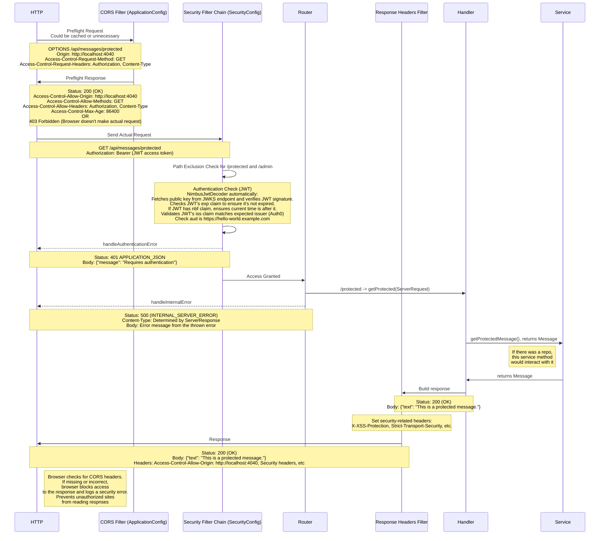

# Spring/Java: API Basic Access Control Code Sample

This Java code sample demonstrates **how to implement authorization** in Spring API servers using Auth0. This Spring code sample builds the API server using Spring functional controllers.

This code sample is part of the ["Auth0 Developer Resources"](https://developer.auth0.com/resources), a place where you can explore the authentication and authorization features of the Auth0 Identity Platform.

Visit the ["Spring/Java + Functional Controllers Code Sample: Authorization For Basic APIs"](https://developer.auth0.com/resources/code-samples/api/spring/basic-authorization/java-functional) page for instructions on how to configure and run this code sample and how to integrate it with a Single-Page Application (SPA) of your choice.

## Why Use Auth0?

Auth0 is a flexible drop-in solution to add authentication and authorization services to your applications. Your team and organization can avoid the cost, time, and risk that come with building your own solution to authenticate and authorize users. We offer tons of guidance and SDKs for you to get started and [integrate Auth0 into your stack easily](https://developer.auth0.com/resources/code-samples/full-stack).

### The Auth2.0 process

### Including the Auth0 process

### Updated with transferred info and related protocols

Original remote:
https://github.com/auth0-developer-hub/api_spring_java_hello-world_functional.git

# Walkthrough of an HTTP request in the application:

## 1. CORS Preflight Request (if needed):
- **Description**:
    - Before the actual request, the browser might send a CORS preflight request (using the `OPTIONS` HTTP method) to check if it's safe to send the actual request.
- **Action**:
    - The `CorsFilter` in `ApplicationConfig` checks this preflight request against the CORS configuration you've set up. If the request's origin, headers, methods, etc., are not allowed by your CORS configuration, the browser will not send the actual request.

## 2. Security Filter Chain:
- **Description**:
    - If the CORS check passes, the browser makes an actual request, which enters the `SecurityFilterChain` in the SecurityConfig.
- **Action**:
    - The `HttpSecurity` configuration in `SecurityConfig` is applied. This configuration dictates how different types of requests should be handled.

### 2.a. Endpoint Authentication:
- **Description**:
    - For routes like `/api/messages/protected` and `/api/messages/admin`, authentication is required.
- **Action**:
    - If the request doesn't have a valid JWT, it will be denied. The JWT is decoded using the `JwtDecoder`. This is where the JWT's signature is verified against the public key of the issuer (Auth0 in this case). If the signature doesn't match, the token is considered tampered and is rejected.

### 2.b. JWT Validation:
- **Description**:
    - After decoding, the JWT's claims (like issuer and audience) are validated.
- **Action**:
- Note. JWTS are Base64Url encoded not for encryption, but to be safe from special character issues with urls
    - The issuer is checked to ensure it matches the expected issuer (from Auth0). The audience is checked to ensure the token is intended for this application. If any of these checks fail, the request is denied.

## 3. Processing the Request:
- **Description**:
    - If all checks pass, the request is forwarded to the appropriate controller or handler method to be processed.
- **Action**:
    - The response is then sent back through the `SecurityFilterChain`, (NOT sure on this yet) which might apply additional processing or headers to the response.

## 4. Response:
- **Description**:
    - The final step where the response is crafted and sent back to the client. More detail TBD

---

# Regarding the private/public key:

- **Description**:
    - When using JWTs for authentication, the token is signed by the issuer using a private key.
- **Action**:
    - The recipient (your application) then verifies the JWT's signature using the issuer's public key. This ensures that the JWT was indeed issued by the expected issuer and wasn't tampered with. In the case of Auth0, the public key is often fetched from a well-known endpoint provided by Auth0. The application doesn't need to know the private key; it only needs the public key to verify the JWT's signature.

## Visualization:

